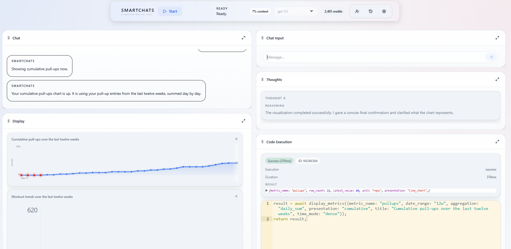
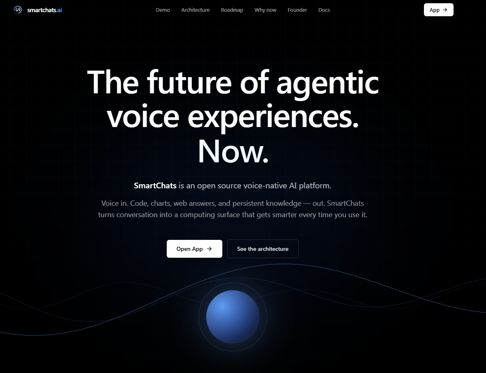

# SmartChats

<p align="center">
  
  &nbsp;
  
</p>

**The future of agentic voice experiences. Now.**

Get started in 2 minutes — install with `curl | sh`.

→ [smartchats.ai](https://smartchats.ai) · [docs](https://smartchats.ai/docs)

---

## Install

```bash
curl -fsSL https://smartchats.ai/install | bash
```

Then:

```bash
smartchats setup
```

That's it. The wizard walks you through your API keys, builds what it needs, and opens [http://localhost:3000](http://localhost:3000). No Docker, no Node, no prereqs — the installer bundles the runtime.

**Other install paths:** `npm install -g smartchats-ai` (if you already have Node 22+), `npx smartchats-ai` (no install), `git clone + npm link` (contributors). Full options at [docs/install](https://smartchats.ai/docs/install).

## What you get

Voice in. Code, charts, web answers, persistent knowledge — out. SmartChats turns conversation into a computing surface that gets smarter every time you use it.

- **Voice-native, cross-device.** Talk naturally, interrupt, switch devices mid-thought. Same agent, same memory.
- **Multi-model routing.** GPT-5.5, Claude Opus 4.7, Gemini 3.1 Pro — pick per task or per turn.
- **Sandboxed code execution + a knowledge graph that compounds.** The agent writes JavaScript that runs in your browser, persists what it learns about you to a local SurrealDB triple store with vector search.
- **MCP both directions.** Consume external MCP servers; expose SmartChats as one to Claude Desktop or any MCP-aware tool.
- **Self-hostable.** The entire stack runs on your laptop with one command. Hosted SaaS optional.

→ **[Read the docs](https://smartchats.ai/docs)** for architecture, full CLI reference, MCP integration, package guides, and contribution workflow.

## Status

🟢 **Production-ready · Open-core release · 2026 Q2**

The hosted SaaS at [smartchats.ai](https://smartchats.ai) runs the same stack you can self-host here. Only multi-tenant cloud orchestration (billing back-end, hosted database, infrastructure) stays private.

## CLI at a glance

```
smartchats setup       guided first-run
smartchats start       launch the local stack
smartchats stop        stop the stack
smartchats status      what's running + health
smartchats logs        tail per-process logs
smartchats doctor      environment health check
smartchats data        import / export user data
smartchats login       sign in to the hosted SaaS
```

Full reference: [docs/cli](https://smartchats.ai/docs/cli).

## Packages

| Package | What it does |
|---|---|
| [`tivi`](https://smartchats.ai/docs/packages/tivi) | Browser voice interface: VAD, STT, TTS, calibration |
| [`cortex`](https://smartchats.ai/docs/packages/cortex) | Function-calling agent runtime + sandbox executor |
| [`smartchats-database`](https://smartchats.ai/docs/packages/smartchats-database) | Pure SurrealQL query builders + ops layer |
| [`smartchats-backend`](https://smartchats.ai/docs/packages/smartchats-backend) | HTTP transport contract, streaming helpers |
| [`smartchats-sessions`](https://smartchats.ai/docs/packages/smartchats-sessions) | Session export + per-session analyzers + cross-session triage |
| [`llm-service`](https://smartchats.ai/docs/packages/llm-service) | Provider-agnostic LLM client (Anthropic / OpenAI / Gemini) |
| [`simi`](https://smartchats.ai/docs/packages/simi) | Declarative E2E workflow tests |
| `smartchats-cli` *(npm: [`smartchats-ai`](https://www.npmjs.com/package/smartchats-ai))* | The `smartchats` command-line tool |
| `smartchats-mcp` | MCP server — expose SmartChats to Claude Desktop / any MCP client |

Plus supporting libraries: `graph-viz`, `smartchats-common`, `smartchats-local-server`, `smartchats-backend-local`, `smartchats-cloud-client`, `smartchats-test`.

## Roadmap

| Quarter | Milestone |
|---|---|
| **Now (Q2 2026)** | **Open Core + Hosted.** MIT-licensed source release. Hosted web app live with managed billing, auth, and infrastructure. |
| Q3 2026 | **Integrations + Mobile.** Native mobile app launch. Third-party integrations buildout — Gmail, Calendar, X, GitHub, and more — so SmartChats can read, write, and act across the apps where users already live. |
| Q4 2026 | **Enterprise.** Three offerings: drop-in voice agent SDK (Tivi), drop-in voice + agent runtime (Tivi + Cortex), and full closed-cloud licensing with deployment support for regulated environments. White-label and self-hosted across all tiers. |

## Contributing

A full contribution policy is being prepared. In the meantime, reach out before opening pull requests:

- 📧 [shay@smartchats.ai](mailto:shay@smartchats.ai)
- 💼 [LinkedIn](https://www.linkedin.com/in/sheun-aluko/)

Working on SmartChats itself? See [docs/contributing](https://smartchats.ai/docs/contributing) for the `npm run dev` / `bin/devserve` workflow.

- 🐛 [Issues](https://github.com/sheunaluko/smartchats/issues) — bugs, feature requests, questions
- 💬 [Discussions](https://github.com/sheunaluko/smartchats/discussions) — design conversations, show-and-tell

## License

[MIT](LICENSE)

## Contact

**Sheun Aluko, MD, MS** — Founder & CEO

- 💼 [LinkedIn](https://www.linkedin.com/in/sheun-aluko/)
